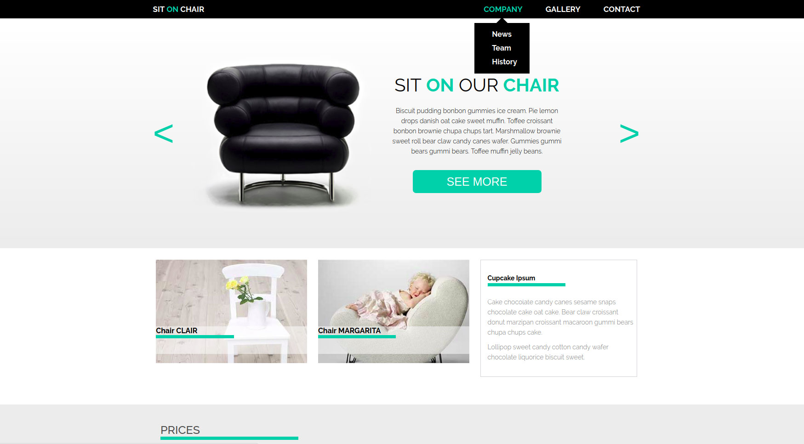

<h1> First project - Sit On Chair - one-page <h1>

<h3> General Information </h3>

 Non-rensponsive one-page, created by using HTML5 and CSS3, during first week on Javascript React Bootcamp.
Page made based on jpg image (scale 1:1 - Pixel Perfect). 

 Elements were added - slider, dropdown menu, using Javascript. 

<h3> Technologies </h3>

 HTML5, CSS, JavaScript 

<h3> Screenshot </h3>
 

